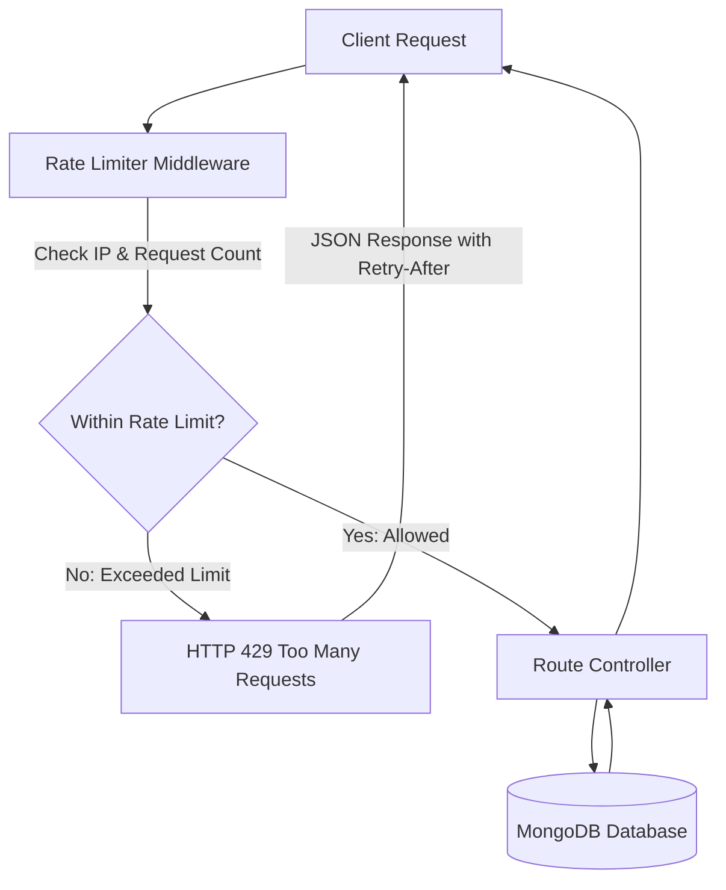

# Rate Limiter Implementation Plan

## Overview
To prevent clients, scrapers, or attackers from hammering `GET` APIs and exhausting database connections, we will implement **Express Rate Limiting** as a gateway middleware layer. 

This blocks excessive requests directly at the middleware level before they ever invoke controller logic or reach the database (MongoDB).

---

## 1. Architecture & Design



---

## 2. Rate Limiting Strategy

We will set up modular and configurable rate limiters in `src/middleware/rateLimiter.middleware.js`:

1. **Global Rate Limiter**:
   - Protects the entire application from DDoS / brute force scraping.
   - Default: e.g., max **100 requests per 15 minutes** per IP.
   - Applied globally in `App.js`.

2. **GET APIs Rate Limiter (Database Protection)**:
   - Targets read-heavy `GET` endpoints (e.g., airports, countries, blogs, cars, bookings).
   - Default: e.g., max **30 to 60 requests per 1 minute** per IP.
   - Prevents rapid repeated GET calls from exhausting DB connections.

3. **Auth / Sensitive Operations Limiter (Optional / Bonus)**:
   - For login, OTP, and registration endpoints.
   - Stricter limit: e.g., max **5 to 10 requests per 15 minutes** to prevent credential stuffing.

4. **Standardized 429 Response**:
   - Matches your project's existing response schema (`data`, `message`, `status`):
   ```json
   {
     "data": null,
     "message": "Too many requests from this IP, please try again in a few minutes.",
     "status": "TOO_MANY_REQUESTS"
   }
   ```
   - Standard HTTP headers included: `RateLimit-Limit`, `RateLimit-Remaining`, `RateLimit-Reset`, `Retry-After`.

---

## 3. Proposed File Changes

### Step 1: Install `express-rate-limit`
```bash
npm install express-rate-limit
```

### Step 2: Create Rate Limiter Middleware
* **[NEW] [src/middleware/rateLimiter.middleware.js](file:///d:/React/GITHUB_DECK/Deck_Backend/Deck_NODE/src/middleware/rateLimiter.middleware.js)**
  - `globalLimiter`: General protection for the app.
  - `getApiLimiter`: Targeted limiter for GET requests / database read queries.
  - `authLimiter`: Strict limiter for authentication & OTP routes.
  - Custom handler for consistent JSON errors and logging.

### Step 3: Update Status Constants
* **[MODIFY] [src/constants/statusConstants.js](file:///d:/React/GITHUB_DECK/Deck_Backend/Deck_NODE/src/constants/statusConstants.js)**
  - Add `TOO_MANY_REQUESTS: 'TOO_MANY_REQUESTS'` to the status map.

### Step 4: Integrate into App and Routers
* **[MODIFY] [src/App.js](file:///d:/React/GITHUB_DECK/Deck_Backend/Deck_NODE/src/App.js)**
  - Apply `globalLimiter` at top-level middleware.
* **[MODIFY] High-traffic controllers / routers**
  - Apply `getApiLimiter` on GET endpoints (or conditionally apply to all GET routes).

---

## 4. Verification Plan

### Automated & Manual Verification
1. **Normal Flow**:
   - Send regular GET requests to `/api/v1/airports` or `/api/v1/countries`.
   - Verify HTTP 200 with standard payload and `RateLimit-Remaining` header decreasing.
2. **Threshold Exceeded Flow**:
   - Send rapid repeated requests (exceeding limit).
   - Verify server returns HTTP 429 with formatted JSON payload:
     ```json
     {
       "data": null,
       "message": "Too many requests from this IP, please try again in a few minutes.",
       "status": "TOO_MANY_REQUESTS"
     }
     ```
   - Verify MongoDB is **not** queried once 429 is triggered.
3. **Tests**:
   - Run test suite: `npm test` to ensure existing tests pass cleanly without being blocked by test runs.
