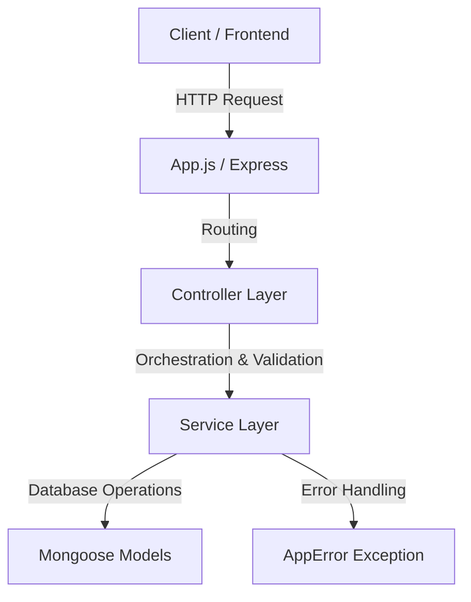

# SOLID Architecture & Refactoring Documentation

This document explains how the **SOLID design principles** were applied during the architectural refactoring of this project, transforming monolithic router files into a highly clean, maintainable, and testable codebase.

---

## 1. Summary of Work Done

We successfully restructured the application from a legacy architecture (where route definition, request handling, business logic, and database operations were tightly coupled inside the router files) into a clean, layered architecture:



### Key Enhancements:
* **Controller-Service Layering**: Separated concerns so routing, orchestration, and business logic are isolated.
* **Clean Models Migration**: Consolidated clean Mongoose schemas under `src/models/` and removed the legacy `src/model/` directory.
* **Comprehensive Test Suite**: Configured **Jest** and wrote **97 unit tests** across 11 test suites covering all business domains with mocked database layers.
* **Linter Compliance**: Eliminated all indentation, formatting, syntax, and Mongoose instantiation errors (such as using `new` incorrectly with `mongoose.model`).

---

## 2. Application of SOLID Principles

### 🟢 Single Responsibility Principle (SRP)
> *"A class or module should have one, and only one, reason to change."*

* **Legacy Issue**: Files under `src/router/` did everything: parsed parameters, performed business calculations, ran raw database queries, sent responses, and caught database failures.
* **SOLID Application**:
  * **Controllers** (e.g., [airport.controller.js](file:///d:/React/API-BitBucket/api_connect/src/controllers/airport.controller.js)) have the sole responsibility of mapping HTTP requests, reading query parameters/payloads, invoking services, and formatting HTTP responses.
  * **Services** (e.g., [airport.service.js](file:///d:/React/API-BitBucket/api_connect/src/services/airport.service.js)) have the sole responsibility of processing business operations and interacting with models.
  * **Models** (e.g., [Airport.js](file:///d:/React/API-BitBucket/api_connect/src/models/Airport.js)) only define schema structures.

---

### 🟢 Open/Closed Principle (OCP)
> *"Software entities should be open for extension, but closed for modification."*

* **SOLID Application**:
  * Adding new features (e.g., a new validation rule or a new sorting method) can be done by extending or adding methods to services without needing to rewrite or modify the routing configuration in controllers.
  * The generic error-handling middleware [errorHandler.js](file:///d:/React/API-BitBucket/api_connect/src/middleware/errorHandler.js) is open to catching new custom error classes as long as they extend the base error class, meaning we never have to modify the middleware code itself to support a new type of error.

---

### 🟢 Liskov Substitution Principle (LSP)
> *"Objects of a superclass should be replaceable with objects of its subclasses without breaking the application."*

* **SOLID Application**:
  * We created a custom [AppError.js](file:///d:/React/API-BitBucket/api_connect/src/exceptions/AppError.js) subclass that inherits from the standard JavaScript `Error` class.
  * Wherever standard errors are handled, `AppError` instances can be substituted seamlessly because they preserve standard error contracts (like stack traces and message properties) while extending them with HTTP status codes.

---

### 🟢 Interface Segregation Principle (ISP)
> *"Clients should not be forced to depend on methods they do not use."*

* **SOLID Application**:
  * In Node.js, we don't have classical interfaces, but we apply this by segregating our services into small, cohesive, domain-specific modules (e.g. `CarService`, `UserService`, `AirportService`) rather than having a single bloated "DatabaseService" class.
  * Controllers only import the specific services they need, preventing tight coupling and reducing execution/memory footprints.

---

### 🟢 Dependency Inversion Principle (DIP)
> *"Depend on abstractions, not concretions."*

* **SOLID Application**:
  * Our layers depend on interfaces and model-level abstractions rather than environment setups.
  * This is most apparent in our **test suite** (e.g., [admin.test.js](file:///d:/React/API-BitBucket/api_connect/tests/unit/admin.test.js)). Because services depend on model abstractions, we can swap the real Mongoose MongoDB connection with mock instances (`jest.mock(...)`) seamlessly. The services run identically during tests without realizing they are using mocks instead of a real database.

---

## 3. Directory Layout

The resulting clean architecture follows this structure:

```
api_connect/
├── src/
│   ├── config/          # Centralized Database and App configurations
│   ├── constants/       # HTTP status codes and standard API messages
│   ├── controllers/     # Controller layer (handles HTTP requests/responses)
│   ├── exceptions/      # Custom application exception classes (AppError)
│   ├── middleware/      # Error handler & Auth validation middlewares
│   ├── models/          # Mongoose database model definitions
│   ├── services/        # Service layer (contains core business logic)
│   ├── utils/           # Validation and utility helpers
│   └── App.js           # Server application mounting root controller routes
├── tests/
│   └── unit/            # Domain-specific Jest unit tests
├── server.js            # Main entry point bootstrapping database & server ports
└── SOLID.md             # This architecture overview file
```
